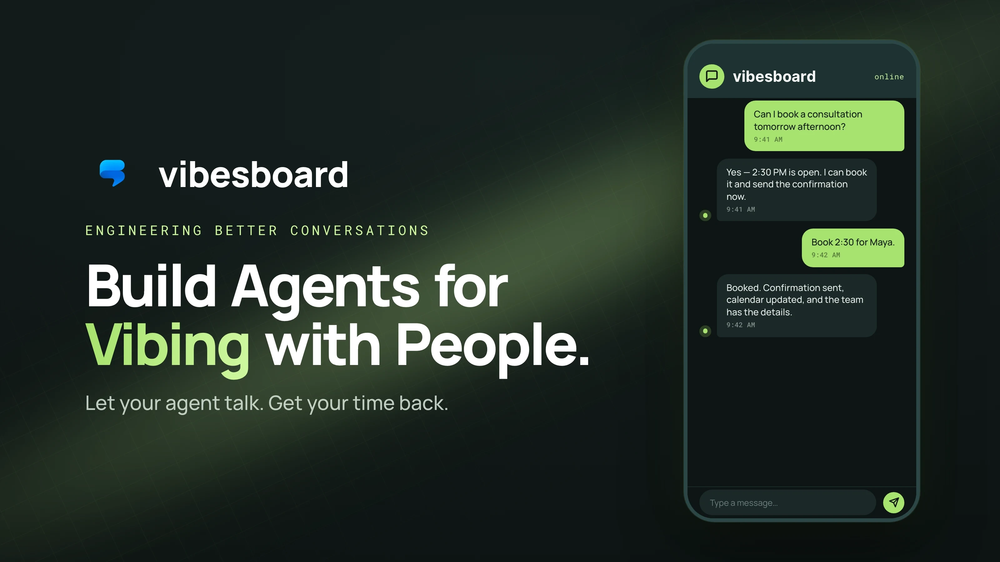
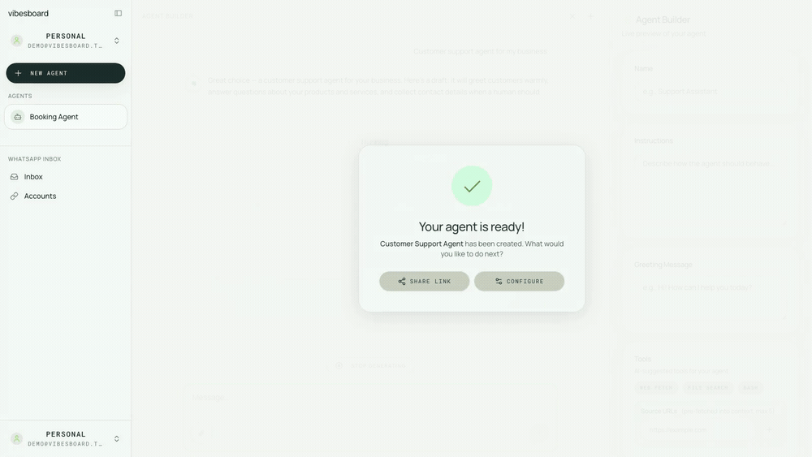
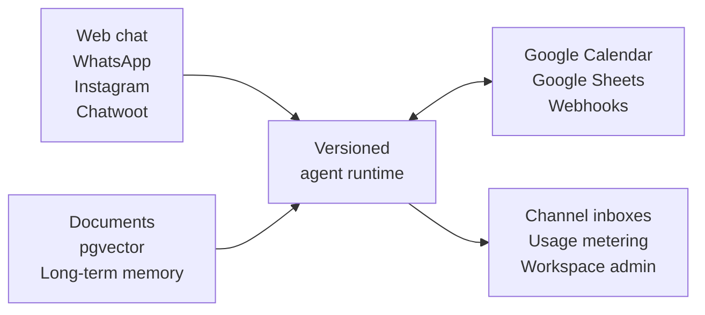

<h1 align="center">Vibesboard</h1>

<p align="center">
  <strong>Open-core platform for AI agents that answer, act, and book—across web and messaging channels.</strong>
</p>

<p align="center">
  Build once. Deploy to web, WhatsApp, and Instagram. Ground every answer in your data, connect real business actions, and operate multiple workspaces from one self-hosted platform.
</p>

<p align="center">
  <a href="#quick-start"><strong>Quick start</strong></a> ·
  <a href="#why-vibesboard"><strong>Why Vibesboard</strong></a> ·
  <a href="#features"><strong>Features</strong></a> ·
  <a href="https://vibesboard.com/docs"><strong>Documentation</strong></a>
</p>

<p align="center">
  <a href="ROADMAP.md"></a>
  <a href="https://vibesboard.com/docs/self-host/cloud-run-deployment"></a>
  <a href="https://vibesboard.com/docs/platform/multi-tenancy-and-rls"></a>
  <a href="https://vibesboard.com/docs/platform/bring-your-own-llm"></a>
  <a href="LICENSE"></a>
</p>

> **Pre-1.0 public beta:** Vibesboard is ready for evaluation and carefully
> operated self-hosting, not a blanket production-readiness claim. APIs and
> deployment requirements may change. Read the [roadmap](ROADMAP.md),
> [support policy](SUPPORT.md), and [security policy](SECURITY.md) before
> deploying it for real users.



## What is Vibesboard?

Vibesboard is a self-hosted, multi-tenant platform for building and operating customer-facing AI agents. It combines the agent runtime with the parts teams usually have to stitch together around it: knowledge and memory, messaging channels and inboxes, business tools, scheduling, model routing, access control, and usage management.

Use it to run a support agent on your website, qualify leads in WhatsApp or Instagram, answer from private documents, call tools through webhooks and data actions, and book directly into Google Calendar—all from one workspace-aware control plane.

The focus is not only creating an agent. It is operating agents safely after they meet real users.

## Why Vibesboard?

Many tools make it easy to demo a chatbot. Vibesboard is built for the operational work that starts after the demo.

| If you need…                             | Vibesboard gives you…                                                                                                            |
| ---------------------------------------- | -------------------------------------------------------------------------------------------------------------------------------- |
| More than a chat playground              | A streaming runtime with tools, lifecycle hooks, public deployment, access gates, configuration history, and rollback            |
| Agents where customers already are       | An embeddable web agent, WhatsApp and Instagram channels with an inbox for each, and Chatwoot sync                               |
| Answers that lead to outcomes            | RAG and long-term memory connected to Google Calendar, Google Sheets, webhooks, and data actions                                 |
| One deployment for many teams or clients | Workspaces, memberships, feature flags, usage metering, optional soft caps, and PostgreSQL row-level security                    |
| Freedom from model lock-in               | OpenAI, Anthropic, Google Gemini, NVIDIA, and OpenAI-compatible providers, routed per agent or task                              |
| Control of data and inference spend      | Self-hosted application, PostgreSQL and S3-compatible storage, encrypted tenant credentials, and bring-your-own-provider support |

## How it fits together



Tenant isolation combines application-level ownership/membership checks with PostgreSQL row-level security, which fails closed on the RLS-enforced role when workspace context is missing. See the [security guide](docs/security.md) for the current boundary and a candid note on paths still using the migrate role.

## Features

### Build and ship agents

- Create agents with an AI-assisted builder and live preview.
- Stream conversations through a tool-enabled runtime.
- Add lifecycle hooks and per-agent settings.
- Publish through public links or an embeddable web widget.
- Protect public agents with configurable access gates.
- Keep version history and restore an earlier configuration.

### Ground agents in your business

- Upload documents for retrieval-augmented generation with pgvector.
- Store files in S3-compatible object storage, with MinIO included for development.
- Re-embed knowledge when a workspace changes embedding provider.
- Enable optional long-term memory across conversations.
- Connect Google Sheets, custom webhook data sources, and agent data actions.

### Turn conversations into action

- Check Google Calendar availability and create bookings.
- Generate ICS confirmations and booking enquiries.
- Call external services through outbound webhooks and data actions.
- Receive and manage WhatsApp and Instagram conversations.
- Synchronise agents with Chatwoot inboxes.

### Operate multiple workspaces safely

- Isolate workspace data with PostgreSQL row-level security—not only application checks.
- Separate normal application access from privileged migration and admin access.
- Encrypt model-provider, OAuth, and messaging credentials at rest.
- Manage memberships, permissions, feature flags, usage tracking, and optional soft caps.
- Authenticate with Google OAuth, verified email and password, or magic links.

### Bring your own model

Connect OpenAI, Anthropic, Google Gemini, NVIDIA, or any compatible OpenAI endpoint, including services such as Groq, Mistral, Together AI, and Ollama. Assign providers to individual agents or tasks (`chat`, `embed`, and `agent_creator`), set workspace defaults, and retain a platform fallback.

## Quick start

### Requirements

- [Bun](https://bun.sh) 1.3.14
- [Node.js](https://nodejs.org) 24 LTS
- Docker with Compose
- An OpenAI API key for the platform fallback model

### Run locally

```bash
git clone https://github.com/NordicAgents/vibesboard.git
cd vibesboard

cp .env.example .env
bun install
bun run db:setup
bun run dev
```

Replace the placeholder credentials and secrets in `.env`, then open <http://localhost:3000>. The setup command starts PostgreSQL, Adminer, and MinIO, creates the local bucket, runs migrations, and seeds the database.

For all setup options and troubleshooting, see [Docker Compose](https://vibesboard.com/docs/self-host/docker-compose) in the docs.

## Tech stack

- **Application:** Next.js 16, React 19, TypeScript, Tailwind CSS, and Radix UI
- **AI:** Vercel AI SDK with OpenAI, Anthropic, Google, NVIDIA, and compatible-provider adapters
- **Data:** PostgreSQL, pgvector, Drizzle ORM, and S3-compatible object storage
- **Authentication:** Better Auth
- **Tooling:** Bun workspaces, Vitest, Playwright, ESLint, Prettier, Semgrep, and Trivy

## Documentation

Full documentation lives at **[vibesboard.com/docs](https://vibesboard.com/docs)** — quickstarts, building and deploying agents, self-hosting, and the platform's security and multi-tenancy model.

| Guide                                                                                   | What you will find                                                               |
| --------------------------------------------------------------------------------------- | -------------------------------------------------------------------------------- |
| [Quickstart](https://vibesboard.com/docs/get-started/quickstart)                        | Run Vibesboard locally in a few minutes                                          |
| [Docker Compose](https://vibesboard.com/docs/self-host/docker-compose)                  | Local setup, commands, ports, and troubleshooting                                |
| [Environment variables](https://vibesboard.com/docs/self-host/environment-variables)    | Every configuration value, grouped by concern                                    |
| [Architecture](https://vibesboard.com/docs/contribute/architecture)                     | Monorepo map, database roles, tenant isolation, and model routing                |
| [Cloud Run deployment](https://vibesboard.com/docs/self-host/cloud-run-deployment)      | The maintained production path, and requirements for self-hosting elsewhere      |
| [Security & credentials](https://vibesboard.com/docs/platform/security-and-credentials) | Tenant isolation, credential handling, outbound request validation, and scanning |
| [Bring your own LLM](https://vibesboard.com/docs/platform/bring-your-own-llm)           | Provider configuration, task routing, and architecture                           |
| [Testing](https://vibesboard.com/docs/contribute/testing)                               | Unit, integration, and end-to-end tests, and how CI runs them                    |

The source Markdown for these guides lives under [`apps/web/content/docs/`](apps/web/content/docs/); [`docs/`](docs/) holds the shorter contributor-facing notes on architecture, configuration, deployment, and security.

## Contributing

Contributions are welcome. Read [CONTRIBUTING.md](CONTRIBUTING.md) for the setup, the checks your pull request has to pass, and how the branches work. In short: branch from `dev`, use a conventional commit, and open a pull request back to `dev`. For a substantial change, open an [issue](https://github.com/NordicAgents/vibesboard/issues) first so the approach can be discussed.

Everyone taking part is expected to follow the [Code of Conduct](CODE_OF_CONDUCT.md).

## Security

Please do not report vulnerabilities in a public issue. [SECURITY.md](SECURITY.md) explains what is in scope and what to expect after you report; use a [private GitHub security advisory](https://github.com/NordicAgents/vibesboard/security/advisories/new) or email <hi@vibesboard.com> to reach the maintainers. [Security & credentials](https://vibesboard.com/docs/platform/security-and-credentials) in the docs covers the tenancy model and isolation guarantees.

## License

Vibesboard is open core. NordicAgents' original Vibesboard work is released
under the [MIT License](LICENSE), with one exception: everything under the
[`ee/`](ee/) directory is the Enterprise Edition and is licensed by
[`ee/LICENSE`](ee/LICENSE) instead. That directory holds commercial add-ons for
the managed service — you never need it to self-host, and `rm -rf ee/` is a
supported build. See [Open core & ee/](https://vibesboard.com/docs/contribute/open-core)
for where the line is drawn; multi-tenancy, workspace isolation, usage metering
and every agent feature stay in the MIT core.

The repository also contains Apache-2.0-derived template code, and the app
renders the Manrope (SIL Open Font License 1.1) and Roboto Mono (Apache-2.0)
typefaces. See [NOTICE](NOTICE) and [LICENSES](LICENSES) for the applicable
copyright and licence texts.
