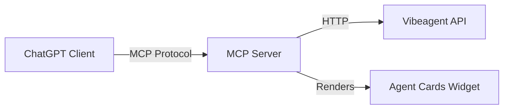

# MCP Server for Vibeagent

## Overview

Build a simple MCP server following the OpenAI Apps SDK pattern that exposes two tools and a UI widget:

- **list_agents** - Returns all agents with their details
- **create_agent** - Creates a new agent and returns it with a QR code for sharing
- **UI Widget** - Displays agents in a card layout with QR codes

## Architecture



## File Structure

```
mcp-server/
  package.json
  tsconfig.json
  src/
    index.ts          # Express server with MCP endpoints
    tools.ts          # Tool definitions (list_agents, create_agent)
    components/
      agent-card.tsx  # React component for agent display with QR
```

## Implementation Details

### 1. MCP Server Entry Point ([mcp-server/src/index.ts](mcp-server/src/index.ts))

- Express server on port 2091
- `/mcp` endpoint for MCP protocol (tools/list, tools/call)
- No authentication (as requested)
- Proxies requests to the main vibeagent API

### 2. Tools Definition ([mcp-server/src/tools.ts](mcp-server/src/tools.ts))

**list_agents:**

- No parameters required
- Returns array of agents with id, name, instructions, agentUrl, tools, createdAt

**create_agent:**

- Parameters: `name` (required), `instructions` (required)
- Returns created agent with QR code data URL
- Uses existing [`lib/qr.ts`](lib/qr.ts) logic

### 3. UI Widget Component

A simple React component rendered in ChatGPT that shows:

- Agent cards in a grid
- Each card displays: name, instructions snippet, QR code image
- Clicking QR opens the agent's public URL

### 4. Dependencies

```json
{
  "@anthropic-ai/mcp-protocol": "latest",
  "express": "^4.18.2",
  "qrcode": "^1.5.4",
  "zod": "^3.25.76"
}
```

## Configuration

The MCP server will need one environment variable:

- `VIBEAGENT_API_URL` - Base URL of vibeagent API (defaults to `http://localhost:3000`)

## Local Development

1. Run vibeagent: `pnpm dev` (port 3000)
2. Run MCP server: `cd mcp-server && npm start` (port 2091)
3. Use ngrok to expose: `ngrok http